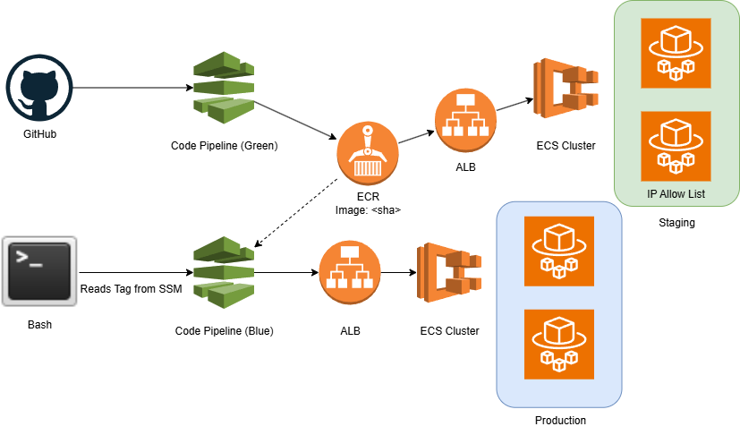
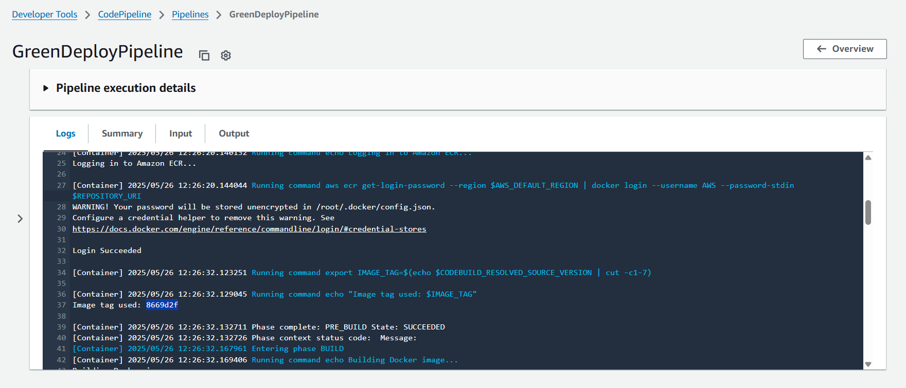

# ECS Blue/Green Deployment Stack (CDK)

This AWS CDK stack defines a **Blue/Green deployment system** for a containerized application hosted on Amazon ECS with Fargate and an Application Load Balancer (ALB). It provisions two fully independent environments, each with its own deployment pipeline:

* **Blue (Production)**: Stable environment that receives live traffic. It is updated only through a dedicated promotion pipeline, manually triggered via CLI.
* **Green (Staging)**: Automatically rebuilt on every push to the GitHub repository through a continuous deployment pipeline. It is isolated behind a firewall rule and only accessible to a specified IP address for staging and QA purposes.

## Features

* 🚀 **CI/CD Integration**: Green is auto-deployed from GitHub on each push. Blue is promoted explicitly.
* 🔐 **Staging Access Control**: Green is restricted to a specific IP address via ALB listener conditions.
* 🟦 **Stable Production Releases**: Blue is only updated through a manually triggered pipeline.
* ♻️ **Isolated Environments**: Separate ECS services, target groups, task definitions, and pipelines for blue and green.
* 📦 **Containerized Deployment**: Built with Docker, stored in ECR, and deployed via ECS Fargate.

## Architecture Overview

This project implements a blue/green ECS deployment strategy with two isolated environments:

- **Staging (Green)** is auto-deployed from GitHub on each push and locked behind an IP allow list.
- **Production (Blue)** is promoted via manual CLI trigger after validation, reading the image tag from SSM Parameter Store.



## Screenshot: Staging (Green) Pipeline Execution

The GreenDeployPipeline automatically builds and pushes a new image to ECR using a short SHA tag for traceability. Below, you can see:

- Secure login to Amazon ECR
- Generation of the SHA-based image tag
- Success message confirming the build phase



## Deployment Prerequisites

* AWS CDK v2 installed
* GitHub access token stored in AWS Secrets Manager under the name `github-token`
* A GitHub repository containing a Dockerized application

## Usage

### Initial Infrastructure Deployment

To initialize the infrastructure (one-time setup or when making infrastructure changes), run:

```bash
cdk deploy --context allowedIp=YOUR.IP.ADDRESS.HERE
```

* `allowedIp`: **Required**. Restricts access to the green environment.

---

### Green Pipeline (Auto-deploys from GitHub)

1. Every push to the `main` branch of your GitHub repo triggers the **GreenDeployPipeline**:

   * Builds a new Docker image (tagged with the commit SHA)
   * Pushes it to ECR
   * Deploys it to the **green** (staging) environment

   Only the IP address specified by `allowedIp` will be able to access this environment.

### Blue Pipeline (Manual CLI-based Promotion)

2. When you're satisfied with the green deployment, promote the validated image tag to production (blue) with two steps:

   #### Step 1: Write the promoted tag to Parameter Store

   ```bash
   aws ssm put-parameter \
     --name /promote/imageTag \
     --value abc1234 \
     --type String \
     --overwrite
   ```

   #### Step 2: Trigger the blue deployment pipeline

   ```bash
   aws codepipeline start-pipeline-execution --name BlueDeployPipeline
   ```

   The **BlueDeployPipeline** will read the image tag from SSM Parameter Store and deploy the corresponding version to the blue (production) environment via CodeDeploy.

---

### Notes

* Green is automatically rebuilt on every GitHub push. It reflects the latest commit on the `main` branch.
* Blue remains stable until its separate pipeline is explicitly re-triggered using an image tag written to SSM.
* You manage the blue/green lifecycle through two isolated pipelines with no risk of accidental overlap.
* Both environments use identical container, CPU, memory, and port settings for parity.
* The `imageTag` context is no longer required for application deployment or promotion.

## Cleanup

```bash
cdk destroy
```
